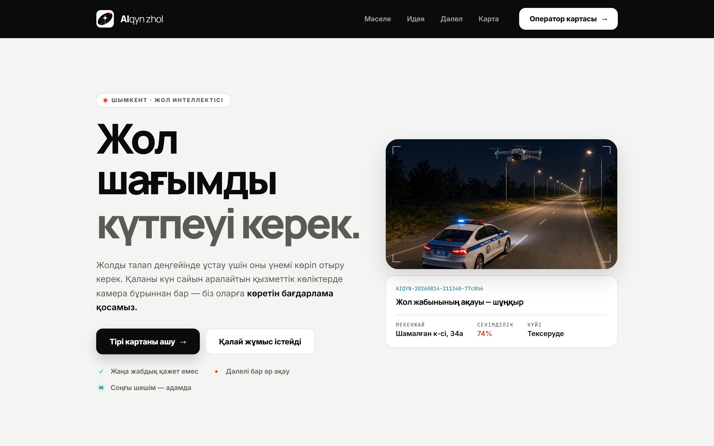
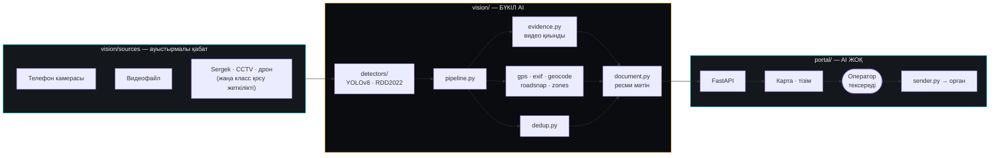

<div align="center">


**Қаладағы камера жол ақауын өзі табады, дәлелін жинайды және ресми құжатты дайындайды.**
*City cameras find road defects, gather the evidence, and produce the filed report.*

[](https://aiqyn-alpha.vercel.app)
[](#-мәселе--шешім)
[](LICENSE)


**[Қазақша](#қазақша) · [English](#english)**

</div>

---



---

# Қазақша

## 🎯 Мәселе → Шешім

**Мәселе.** Жол ақауын тіркеу бүгін толық қолмен жүреді: біреу шұңқырды көреді → суретке түсіреді → өтініш жазады → мекенжайын іздейді → ресми тілде рәсімдейді → жібереді. Әр қадам адам уақыты, ал нәтижесі — тіркелген ақаудың саны шын санынан әлдеқайда аз.

**Шешім.** AIQYN осы тізбекті толық автоматтайды және адамға тек **соңғы шешімді** қалдырады:

```
камера → AI детекция → 5–10 сек видео дәлел → ресми санат
       → GPS → мекенжай → қазақша/орысша ресми мәтін
       → ДАЙЫН ҚҰЖАТ → сайт → оператор растайды → жауапты органға
```

Оператор ештеңе жазбайды. Ол тек **тексереді және бір батырманы басады**.

## 🧩 Жүйенің екі бөлігі — және неге солай

| Бөлік | Не істейді | Не істемейді |
|---|---|---|
| **AIQYN Vision** (`vision/`) | Бүкіл AI: детекция, дәлел жинау, классификация, мекенжай, құжат құрастыру | Карта көрсетпейді, органға өзі жібермейді |
| **AIQYN Portal** (`portal/`) | Дайын құжатты қабылдау, картада көрсету, оператор тексеруі, жіберу, статус | **Ешқандай AI/ML жоқ** — ештеңе есептемейді |

**Бұл бөліністің мәні — детекция қабаты камера көзіне тәуелсіз.** Бүгін телефон, ертең Sergek/CCTV немесе дрон: `vision/sources/` ішіне бір ғана класс қосылады, қалған код өзгермейді.

Қосымша нәтиже: порталда torch жоқ болғандықтан сервер ~80 МБ болып, тегін тарифке сыяды (2 ГБ емес).

## ✨ Мүмкіндіктер

- **YOLOv8 детекция** — RDD2022 датасетінде (47 420 сурет) үйретілген. Кластары: шұңқыр, бойлық / көлденең / торлы жарық.
- **Видео дәлел** — әр ақауға 5–10 секундтық қиынды автоматты сақталады, кадрда белгіленген аймақпен.
- **Мекенжайды анықтау** — GPS → geocode → жол сызығына түсіру (`roadsnap.py`), нақты көше атауымен.
- **Аймақ логикасы** (`zones.py`) — жөндеу жүріп жатқан учаске мен полигон/полилиния коридорын ескереді, әйтпесе жүйе жөндеуші бригаданы ақау деп тіркер еді.
- **Қайталауды сүзу** (`dedup.py`) — бір шұңқыр екі рет өтсе, екі өтінім жасалмайды.
- **Ресми құжат** — қазақша/орысша, `python-docx` арқылы `.docx`, басып шығаруға дайын нұсқасымен.
- **Оператор порталы** — карта, тізім, статус тізбегі, CSV экспорт, растау және жіберу.
- **`doctor` командасы** — кітапхана, модель, шрифт, қалта, телефон, GPS және сайт күйін бір рет тексереді.

## 🏗 Архитектура



## 🛠 Технологиялар

| Қабат | Не қолданылады |
|---|---|
| **Компьютерлік көру** | YOLOv8 (`ultralytics`) · OpenCV · NumPy · Pillow |
| **Сервер** | FastAPI · Uvicorn · Pydantic 2 · SQLite |
| **Құжат** | `python-docx` · басып шығаруға арналған HTML шаблон |
| **Гео** | EXIF GPS · geocode · polyline corridor matching |
| **Деплой** | Vercel (`@vercel/python`, тек portal) |
| **Тест** | `unittest` — 9 backend contract тесті |

## 🚀 Іске қосу

**Талап:** Python 3.12+

### Тек сайт (жеңіл — AI керек емес)

```bash
python -m pip install -r requirements-portal.txt
python -m uvicorn portal.app:app --port 8000
```

`http://localhost:8000` — демо деректерімен толы карта бірден ашылады.

### Толық жүйе (детекциямен)

```bash
python -m pip install -r requirements.txt   # ultralytics + torch, ~200–800 МБ
python scripts/fetch_weights.py             # YOLOv8 салмағы, ~85 МБ
python -m vision.main doctor                # бәрін тексеру
python -m vision.main run                   # детекцияны бастау
```

### Windows үшін дайын жарлықтар

`AIQYN.bat` — түймелері бар қалыпты қолданба (терезе ішінде камера көрінісі, ІСКЕ ҚОСУ / ТОҚТАТУ).
Қосымша жарлықтар: [`scripts/windows/`](scripts/windows/).

## ✅ Тексеру

```bash
python -m unittest discover -s tests -v
```

Соңғы жүргізу: **9 тест, барлығы өтті.** Тесттер `unittest`-те, сыртқы runner қажет емес.

Синтаксисті толық тексеру (torch орнатпай-ақ):

```bash
python -m compileall -q vision portal api scripts
```

## 🗺 Roadmap

- [ ] `vision/pipeline.py:329` — ЦС ГГ НИПД реестрімен салыстыру *(жалғыз ашық TODO)*
- [ ] `vision/pipeline.py` мен `vision/geo.py` үшін тест жабыны — қазір тек portal contract тесттері бар
- [ ] Sergek / CCTV дереккөзін `vision/sources/` ішіне қосу
- [ ] Ақауды жөндеу мерзімі бойынша SLA бақылауы
- [ ] Оператор порталына рөлдік рұқсаттар

## 👤 Автор

**[@mansurkenma54](https://github.com/mansurkenma54)**

- Telegram: [@abilmansurk](https://t.me/abilmansurk)
- Email: kenmamansur@gmail.com

[CONTRIBUTING.md](CONTRIBUTING.md) · [CODE_OF_CONDUCT.md](CODE_OF_CONDUCT.md) · [SECURITY.md](SECURITY.md)

## 📄 Лицензия

[MIT](LICENSE)

---

# English

## 🎯 Problem → Solution

**Problem.** Reporting a road defect is entirely manual today: someone spots a pothole, photographs it, writes a request, looks up the address, phrases it officially, and files it. Every step costs human time — and the number of defects actually recorded ends up far below the number that exist.

**Solution.** AIQYN automates the whole chain and leaves a human only the final decision:

```
camera → AI detection → 5–10 s video evidence → official category
       → GPS → street address → Kazakh/Russian official wording
       → FINISHED DOCUMENT → portal → operator confirms → sent to the authority
```

The operator writes nothing. They **review and press one button**.

## 🧩 Two halves, on purpose

| Part | Does | Does not |
|---|---|---|
| **AIQYN Vision** (`vision/`) | All AI: detection, evidence, classification, address, document assembly | No map, does not send anything itself |
| **AIQYN Portal** (`portal/`) | Receives finished documents, maps them, operator review, sending, status | **No AI/ML at all** |

**Why this split matters: the detection layer is independent of the camera source.** Phone today; Sergek/CCTV or a drone tomorrow — add one class under `vision/sources/` and nothing else changes.

A useful side effect: with no torch in the portal, the server is ~80 MB and fits the free tier instead of 2 GB.

## ✨ Features

- **YOLOv8 detection** trained on RDD2022 (47,420 images): pothole, longitudinal / transverse / alligator cracking.
- **Video evidence** — a 5–10 s clip saved automatically per defect, with the detection box drawn in.
- **Address resolution** — GPS → geocode → snap to the road polyline (`roadsnap.py`).
- **Zone logic** (`zones.py`) — active roadworks and polygon/polyline corridors are excluded, otherwise the system would file the repair crew as a defect.
- **Deduplication** (`dedup.py`) — driving past the same pothole twice does not create two reports.
- **Official document** in Kazakh/Russian as `.docx`, plus a print-ready view.
- **Operator portal** — map, list, status chain, CSV export, confirm and send.
- **`doctor` command** — one-shot check of libraries, model, fonts, folders, phone, GPS and site.

## 🚀 Quick start

**Requires:** Python 3.12+

```bash
# portal only — no ML dependencies
python -m pip install -r requirements-portal.txt
python -m uvicorn portal.app:app --port 8000

# full system
python -m pip install -r requirements.txt
python scripts/fetch_weights.py
python -m vision.main doctor
python -m vision.main run
```

## ✅ Verification

```bash
python -m unittest discover -s tests -v
```

Last run: **9 tests, all passing.**

## 👤 Author

**[@mansurkenma54](https://github.com/mansurkenma54)** — Telegram [@abilmansurk](https://t.me/abilmansurk) · kenmamansur@gmail.com

## 📄 Licence

[MIT](LICENSE)
