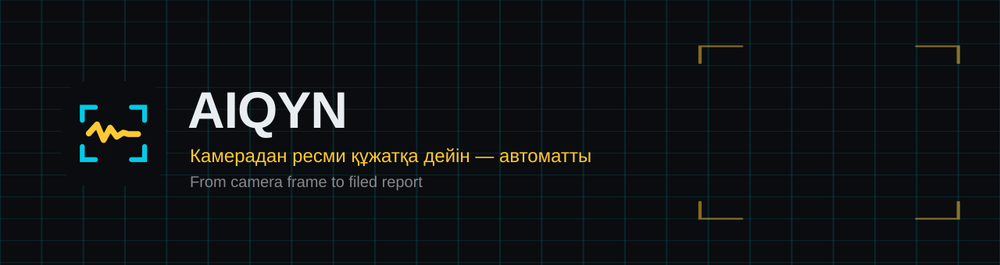

<div align="center">



**Камера жол ақауын өзі табады, дәлелін жинайды және ресми өтінімді дайындайды.**
*City cameras find road defects, gather the evidence, and prepare the filed report.*

[](https://aiqyn-alpha.vercel.app)
[](https://github.com/mansurkenma54/aiqyn/actions/workflows/ci.yml)
[](LICENSE)


</div>

---

# AIQYN — қала жол инфрақұрылымын ЖИ арқылы автоматты бақылау

**SmartCity Hackathon 2026 · Шымкент**

Камера ағынынан ресми құжатқа дейінгі толық тізбек:

```
камера → AI детекция → 5-10 сек видео дәлел → ресми санат
       → GPS → мекенжай → қазақша/орысша ресми мәтін
       → ДАЙЫН ҚҰЖАТ → сайт → оператор растайды → жауапты органға жіберіледі
```

---

## Жүйенің екі бөлігі

| Бөлік | Не істейді | Не істемейді |
|---|---|---|
| **AIQYN Vision** (`vision/`) | Бүкіл AI: детекция, дәлел жинау, классификация, мекенжай, құжат құрастыру | Карта көрсетпейді, органға өзі жібермейді |
| **AIQYN Portal** (`portal/`) | Дайын құжатты қабылдау, картада көрсету, оператор тексеруі, жіберу, статус | **Ешқандай AI/ML жоқ** — ештеңе есептемейді |

Бұл бөліністің мәні: детекция қабаты камера көзіне тәуелсіз. Бүгін — телефон,
ертең — Sergek/CCTV немесе дрон: тек `vision/sources/` ішіне бір класс қосылады,
қалған код өзгермейді.

---

## 0. Жюриге арналған құжаттар

Питчке дайындалып жатсаңыз — [`docs/`](docs/) қалтасынан бастаңыз:

| Файл | Не үшін |
|---|---|
| [`docs/claims.md`](docs/claims.md) | **Бірінші осыны оқыңыз.** Әр санның күйі: расталған / өлшенген / демо / жол картасы |
| [`docs/model-card.md`](docs/model-card.md) | Модель, кластары, өлшенген өнімділігі, шектеулері |
| [`docs/architecture.md`](docs/architecture.md) | Толық тізбек, қазір бар / жоспарда бар |
| [`docs/demo-script.md`](docs/demo-script.md) | 3 минуттық маршрут + сақтандыру нұсқалары |
| [`docs/pilot-plan.md`](docs/pilot-plan.md) | 5 кезең, KPI, тәуекелдер, бизнес моделі |
| [`docs/data-privacy.md`](docs/data-privacy.md) | Қандай дерек жиналады, не жиналмайды |
| [`docs/offline-demo.md`](docs/offline-demo.md) | Интернетсіз жұмыс және тексеру тізімі |

**Негізгі ереже: өлшенбеген сан айтылмайды.** Сайттағы әр метриканың
артында `scripts/benchmark.py` арқылы қайталауға болатын өлшем тұр.

---

## 1. Орнату

```bash
python -m pip install -r requirements.txt
python scripts/fetch_weights.py

# Демо алдында бір рет (интернет барда):
python scripts/vendor_assets.py    # Leaflet, Font Awesome, шрифттер жобаның ішіне
python scripts/cache_tiles.py      # картаның офлайн көшірмесі
python scripts/benchmark.py        # өнімділікті өлшеу
python scripts/export_demo.py      # Vercel сайтындағы демо деректерін жаңарту
vercel --prod                      # сайтты жариялау
```

Сайт: <https://aiqyn-alpha.vercel.app> · Оператор картасы:
<https://aiqyn-alpha.vercel.app/portal>

> `export_demo.py` жергілікті дерекқордағы оқиғаларды `portal/demo/` ішіне
> көшіреді (фотолар 1280 px-ке кішірейтіледі, видео алынбайды). Оны
> жүргізбесеңіз, Vercel-дегі карта ескі деректермен ашылады.

`fetch_weights.py` — RDD2022 датасетінде (47 420 сурет) үйретілген YOLOv8
салмағын жүктейді (~85 МБ). Кластары: шұңқыр, бойлық/көлденең/торлы жарық.

## 2. Тексеру

```bash
python -m vision.main doctor
```

Кітапханалар, модель, шрифт, қалталар, телефон, GPS және сайт — бәрін тексереді.

---

## 3. Іске қосу

### Сайт (алдымен осыны)

```bash
python -m uvicorn portal.app:app --port 8000
```

Ашу: <http://localhost:8000> · Оператор: `admin` / құпия сөз `.env` ішінде (`AIQYN_ADMIN_PASSWORD`)

### Программа

```bash
# телефон камерасынан (негізгі режим)
python -m vision.main run

# видеофайлдан — телефонсыз демо/тест
python -m vision.main run --source file --video жол.mp4

# дайын фотодан
python -m vision.main images фото.jpg
python -m vision.main images C:\фотолар\ --lat 42.3156 --lon 69.5869

# RTSP — Sergek/CCTV/дрон (Phase 2, код дайын)
python -m vision.main run --source rtsp --rtsp-url rtsp://камера/stream
```

Басқару: `q` — шығу, `d` — панельді жасыру, `space` — кідірту.

---

## 4. Телефонды қосу (IP Webcam)

1. Play Store → **IP Webcam** орнату
2. Қосымшаны ашып, ең төмен түсіп → **Start server**
3. Телефон: Параметрлер → Байланыстар → **Модем режимі → USB модем (ҚОСУ)**
4. Қосымша экранның төменінде мекенжай көрсетеді (мыс. `192.168.42.129:8080`)
5. Тексеру: `python -m vision.main doctor`
6. Мекенжай басқа болса: `python -m vision.main run --phone-host 192.168.x.x`

Табылмаса: `python -m vision.main scan` — желіні өзі іздейді.

**GPS:** телефонда орналасқан жерге рұқсат беріңіз — координата сол қосымшаның
`/sensors.json` нүктесінен келеді, бөлек GPS-модуль қажет емес.

### Камераны дұрыс орнату (МАҢЫЗДЫ)

Модель **dashcam ракурсында** үйретілген. Телефонды әйнекке ~1.2–1.5 м биіктікте,
15–20° төмен қаратып бекітіңіз. Кадрдың басым бөлігі — ЖОЛ болуы керек.

**Кадрды кеспеңіз.** Шұңқыр кадрдың төменгі бөлігінде — көлікке ең жақын
жерде — көрінеді. Өлшенген нәтиже: `--crop-bottom 0.30` қосылғанда сол
видеодан **0 ақау**, кесусіз **2 ақау** табылды. Кесу тек панель (торпедо)
шынымен кадрдың төменгі бөлігін жауып тұрғанда ғана қажет:

```bash
python -m vision.main run --crop-bottom 0.20    # тек панель көрінсе
```

---

## 5. API кілттері

`.env` файлында сақталады (ол `.gitignore`-да — GitHub-қа шықпайды).
**Gemini мен 2ГИС кілттері қойылған әрі тексерілген.**

| Қызмет | Күйі | Не береді |
|---|---|---|
| Google Gemini | ✅ қосулы | Талдау, сипаттама, құжат мәтіні, жалған детекцияны сүзу |
| 2ГИС | ✅ қосулы | Нақты мекенжай: «Шымкент, Сарыағаш көшесі, 21» |
| Telegram | ⬜ бос | Ақау табылғанда телефонға хабар |
| `AIQYN_INGEST_TOKEN` | ✅ қойылған | Сайт құжатты тек осы кілтті білетін камера программасынан қабылдайды |

### 5.1 ИИ сарапшысы — екінші саты

YOLO тапқан ақаудың дәлел фотосын Gemini көру моделі қарап шығып,
**инженерлік қорытынды** жазады:

```
1-саты  YOLOv8 (ноутбукта, ~50 мс)  →  «мұнда бірдеңе бар»
2-саты  Gemini (~3-4 сек)           →  талдау + ресми мәтін
```

Не қайтарады:
- **Тексеру:** бұл шынымен ақау ма, әлде көлеңке/ескі жамау ма
- **Өлшемі:** «ені ~100 см, ұзындығы ~50 см, тереңдігі ~10-15 см»
- **Жолдағы орны:** «жүру бөлігінің орталық және оң жақ жолақтарында»
- **Қауіптілігі:** «доңғалақ пен аспаны зақымдау, рөлден айырылу қаупі»
- **Ұсынылатын шара + мерзімі:** «жедел жөндеу (24 сағат ішінде)» → 1 күн
- **Ресми мәтін:** қазақша және орысша, іс қағаз стилінде

Бұл мәтін құжатқа «ТАЛДАУ ҚОРЫТЫНДЫСЫ» бөлімі болып кіреді.

Жоққа шығарылған детекция құжат болып жіберілмейді, бірақ
`evidence/*.rejected.json` болып сақталады — модельді жақсарту материалы.

Баптау (`config.json`):
- `"ai_verify": false` — мүлдем өшіру
- `"ai_drop_rejected": false` — жоққа шығарғанын да жіберу (тек белгілеп қою)

Кілтті ауыстыру керек болса: <https://aistudio.google.com/apikey> →
`.env` ішіндегі `AIQYN_AI_API_KEY`. Модель атауы сәйкес келмесе,
`doctor` қолжетімді модельдер тізімін көрсетеді.

Басқа қызметті де қолдануға болады (OpenRouter, Groq, жергілікті модель):
```
AIQYN_AI_PROVIDER=openai
AIQYN_AI_BASE_URL=https://openrouter.ai/api/v1
AIQYN_AI_MODEL=<модель атауы>
```

Өшіру: `config.json` ішінде `"ai_verify": false`.
Тек белгілеп қою, бірақ өшірмеу: `"ai_drop_rejected": false`.

### 5.2 Telegram хабарламасы

**Не істейді:** ақау табылған сәтте оператордың телефонына фотосымен,
мекенжайымен және карта сілтемесімен хабар келеді. Демо кезінде әсерлі.

**Кілт алу:**
1. Telegram-да **@BotFather** → `/newbot` → атау беріңіз → токенді көшіріңіз
2. Өз ботыңызға кез келген хабар жазыңыз
3. Браузерден ашыңыз: `https://api.telegram.org/bot<ТОКЕН>/getUpdates`
4. Ішінен `"chat":{"id":123456789}` санын алыңыз
5. `.env` ішіне:
   ```
   AIQYN_TELEGRAM_TOKEN=токен
   AIQYN_TELEGRAM_CHAT_ID=сан
   ```

Тек ауыр ақаулар туралы хабарлау: `AIQYN_TELEGRAM_MIN_SEVERITY=high`

### 5.3 2ГИС мекенжайы — қосулы

Мекенжай реті: **2ГИС** → табылмаса **OpenStreetMap** → ол да болмаса
координата бойынша мәтін. 2ГИС тек нақты (ғимарат/көше) нәтижені береді;
жалпы аудан атауы («Аль-Фараби») қабылданбайды, ондай жағдайда
OpenStreetMap сыналады.

---

## 5B. Дәлел фотосы қалай көрінеді

Ресми құжатқа түсетін фото «жай ғана жол суреті» емес — ақау сол суретте
белгіленген болады:

- жоғарғы жолақ: `REC ● AI ROAD SCAN`, координата, күні мен уақыты
- ақаудың айналасында түсті тіктөртбұрыш + нөмір чипі (`01`) + санат пен сенімділік
- жол шекаралары (екі жолақ та анық көрінсе) көгілдір сызықпен

Қатар түпнұсқа, белгіленбеген кадр да сақталады:
`evidence/{event_id}_raw.jpg` — дау туған жағдайда өңделмеген дәлел ретінде.

Кадрды кесудің қажеті жоқ — әдепкі мән 0. Кесу шұңқыр көрінетін аймақты
жойып жіберуі мүмкін (жоғарыдағы ескертуді қараңыз).

Порталға жібермей, бір суретте камера интерфейсін тексеру:

```bash
python scripts/render_camera_preview.py "жол-суреті.jpg" "audit/camera-preview.jpg"
```

Бұл команда сыртқы AI сервисін шақырмайды; жергілікті RDD моделі, жол
геометриясы және HUD ғана іске қосылады.

---

## 5A. Құжатты тексеру, тіркеу және жабу

Әр ақау бойынша сайттан үш нәрсе жасауға болады:

| Түйме | Не істейді |
|---|---|
| **⬇ Word құжаты** | `.docx`: жіберілгенге дейін «ӨТІНІМ ЖОБАСЫ» деп белгіленеді; оператор мен тіркеу деректері бар кезде ғана ресми өтінім күйіне өтеді |
| **🖨 PDF / басып шығару** | Браузерден PDF ретінде сақтау |
| **Орнын нақтылау** | Маркердің ұшын картадағы жолдың нақты нүктесіне бекітеді; бастапқы координата мен өзгеріс тарихта қалады |
| **Тексеру және ЕКЦ 109-ға жіберу** | Оператор растағаннан кейін өтінім бапталған БАРЛЫҚ арнамен қатар кетеді (109 адаптері, email, WhatsApp, Telegram); әр арнаның квитанциясы сақталады |
| **WhatsApp** | Дайын мәтінмен WhatsApp ашылады — кілтсіз жұмыс істейтін жалғыз нақты арна |
| **Жұмыс басталды** | Өтінімді орындалу кезеңіне ауыстырады |
| **Орындалғаннан кейінгі фото** | After-фотоны тіркеп, өтінімді міндетті қайта тексеруге жібереді |
| **Қайта тексерілді — жабу / қайта ашу** | Жөндеу нәтижесін тәуелсіз тексеріп, істі жабады немесе орындаушыға қайтарады |
| **⬇ Есеп (CSV)** | Барлық ақау бір кестеде — Excel-де ашылады, әкімдікке есеп беруге дайын |

Жұмыс ағыны: `тексерілмеген → оператор растады → жіберілді → орындалуда
→ қайта тексеруде → жабылды/қайта ашылды`. Модель сенімділігі ақаудың
ауырлық деңгейі болып саналмайды; интерфейсте бұл екі көрсеткіш бөлек тұр.

### Өтінім қалай ЖЕТЕДІ (ЕКЦ 109 интеграциясы)

Ресми iKOMEK 109-дың ашық API-і жоқ. Сондықтан жүйе бір арнаға байланып
қалмайды — өтінім **төрт арнамен қатар** кетеді, әрқайсысы өз квитанциясын
қайтарады. Жалған «жіберілді» ешқашан жазылмайды: арна бапталмаса,
интерфейсте де, есепте де «бапталмаған» деп тұрады.

| Арна | Кілт керек пе | Не істейді |
|---|---|---|
| **109 адаптері** | `AIQYN_109_URL` | Әкімдік API берген күні сілтемені қою жеткілікті — кодта ештеңе өзгермейді. Бос болса, өтінім тікет журналына жазылады (аудит ізі) |
| **Email** | Brevo кілті **немесе** Gmail қосымша құпиясөзі | Ресми хат: ішінде оқиға деректері, координата, жол сегменті; тіркемеде **`.docx` құжаты, фото және видео** |
| **WhatsApp** | **жоқ** | Дайын мәтінмен `wa.me` сілтемесі — оператор бір басады, хабар шынымен жетеді |
| **Telegram** | бот токені (1 минут) | Жедел хабарлама фотосымен |

Баптау — қолмен емес, шебермен:

```
python scripts/setup_delivery.py
```

Ол сұрайды, `.env`-ге жазады және **бірден сынақ жібереді** — жеткен-жетпегені
сол жерде көрінеді. Кілт тек өз компьютеріңізде қалады (`.env` — `.gitignore`
ішінде).

**Email үшін не таңдау керек.** Gmail тек «қосымша құпиясөзбен» (app password)
істейді, ал ол екі сатылы кіру қосулы болғанда ғана шығады; мектеп/жұмыс
аккаунтында әкімші оны мүлдем өшіріп қоюы мүмкін. Сондай-ақ Vercel-де Gmail-дың
587-порты жиі жабық. **Brevo** — қосымша құпиясөз де, домен де қажет емес,
Vercel-де де істейді. Сондықтан әдепкі ұсыныс — Brevo.

**Демо қауіпсіздігі.** `AIQYN_DELIVERY_FORCE_TO` айнымалысы барлық өтінімді бір
поштаға бұрады — аймақтың өз мекенжайы болса да. Сахнада нақты мемлекеттік
мекемеге қате хат кетіп қалмауының кепілі. Нақты мекеменің поштасын
**келісімсіз қоюға болмайды**: растаусыз ресми өтінім жалған шағым болып
саналады.

Арналардың күйін тексеру:

```
curl http://localhost:8000/api/delivery/health
```

### Автоматты жіберу (әдепкі күйі — ӨШІРУЛІ)

Оператордың растауынсыз жіберу мүмкіндігі бар, бірақ **әдепкі күйде
өшірулі, әрі солай қалғаны дұрыс**: расталмаған автоматты өтінім жалған
шағым болып саналуы мүмкін. Пилот кезеңінде әкімдікпен келісілгеннен
кейін қосылады.

Қосу (`.env`):
```
AIQYN_AUTO_SEND=true
AIQYN_AUTO_SEND_REQUIRE_AI=true          # тек ИИ растағандары
AIQYN_AUTO_SEND_MIN_CONFIDENCE=0.85
AIQYN_AUTO_SEND_MIN_SEVERITY=high        # тек ауыр ақаулар
```

Питчте айтуға ыңғайлы: *«Толық автоматты режим техникалық дайын, бірақ
әдепкі күйде оператор растауы міндетті — жауапкершілік адамда қалады.»*

---

## 6. Жөндеу аймақтары мен жабық жолдар

**Мәселе:** жол жөнделіп жатқан учаскеде ақау көп, бірақ ол туралы хабарлаудың
қажеті жоқ — жұмыс бұрыннан жүріп жатыр. Жүйе ондай жерден ондаған өтінім
жіберсе, оператор да, жауапты орган да оны бірден өшіріп тастайды.

**Шешім:** оператор картада көше осінің бойымен сызық сызады. Сары сызық —
жұмыс жүріп жатқан учаске, қызыл үзік сызық — жабық жол. AI құжатын
автоматты тоқтату тек оператор ресми негізін толтырып, **«Шекараны
оператор нақтылады»** белгісін қойғаннан кейін іске қосылады.

Қалай жасалады:
1. Сайтта **«Оператор»** батырмасы арқылы кіріңіз (`admin` / `.env` ішіндегі құпия сөз)
2. Жоғарыдағы **«Жол учаскесін белгілеу»** батырмасын басыңыз
3. Жол осінің бойымен кемінде екі нүкте қойыңыз; бұрылыста қосымша нүкте қосыңыз
4. Түрін, «қай жерден — қай жерге дейін», күндерін және дәліз енін толтырыңыз
5. Расталған учаске үшін жауапты ұйымды, тапсырма нөмірін/ресми сілтемені
   көрсетіп, **«Шекараны оператор нақтылады»** жалаушасын қойыңыз

### Нақты аймақтарды бірден жүктеу

Шымкенттің ашық жарияланған жол жұмыстары жоспары бойынша анықтамалық аймақтар
дайын тұр (Мөмінов, Тіленшин, Қазиев, Исраилов, Қонаев, Юсупов,
Тамшыбұлақ, Сәремі, Жаңақұрылыс, Алтынсарин):

```bash
python scripts/seed_zones.py
```

Координаталар 2ГИС арқылы көше атауы бойынша алынады — ойдан құрылмайды.
Алдын ала қарау үшін: `python scripts/seed_zones.py --dry-run`

**Ескерту:** бастапқы шеңберлер — көшенің анықтамалық нүктесі ғана. Олар
картада үзік шеңбер болып көрінеді және AI оқиғаларын тоқтатпайды. Нақты
шекара әкімдік/мердігер құжатымен расталып, жол бойымен сызық ретінде
енгізілуі керек.

Сары/қызыл сызықтардың интерфейс демосын қосу (нақты коммуналдық жұмыс деп
саналмайды және автоматты suppression жасамайды):

```bash
python scripts/seed_demo_road_lines.py
```

| Түрі | Мағынасы | Картадағы түсі |
|---|---|---|
| Жөндеу жүріп жатыр | Уақытша, мерзімі өткенде автоматты күшін жояды | Сары |
| Жабық жол | Жол жабық | Қызыл, үзік сызық |
| Есепке алынбайды | Басқа себеппен | Сұр |

Программа аймақтарды сайттан 60 секунд сайын жүктеп тұрады, сондықтан
жүйені қайта қосудың қажеті жоқ. Интернет үзілсе — соңғы тізім
`zones_cache.json` файлынан алынады.

Журналда былай көрінеді:

```
Жөндеу аймағы «Тәуке хан даңғылы» — 3 ақау есепке алынбады (repair)
...
Жөндеу аймағында       : 5 (есепке алынбады)
```

Архивтеу: учаскені картадан басып, **«Учаскені архивтеу»**. Жазба жойылмайды,
аудит үшін сақталады. Автоматты тоқтатуды толық өшіру:
`config.json` ішінде `"skip_in_zones": false`.

---

## 7. Маңызды баптаулар (`config.json`)

| Баптау | Мәні |
|---|---|
| `stream_latency_sec` | **Ағын кідірісі.** Далалық тесте нақтылаңыз — GPS дәлдігі осыған тәуелді (60 км/сағ = 17 м/сек) |
| `conf_threshold` | Сенімділік шегі (әдепкі **0.30** — өлшеніп таңдалды). Көп жалған тапса → 0.45 |
| `tile_detect` | Дәлдеу режимі: жол бөлігін бөлек кесінділермен де талдау (3 есе көп табады) |
| `merge_fragments` | Үлкен қирау аймағының бөлшектерін бір ақауға біріктіру |
| `ai_drop_rejected` | ИИ жоққа шығарса құжатты мүлдем құрмау. **Әдепкі: жоқ** — ИИ кеңес береді, шешімді инженер қабылдайды |
| `async_detect` | Талдауды бөлек ағында жүргізу (әдепкі: иә). Осы арқылы видео 30 кадр/сек ойналады |
| `detect_max_hz` | Секундына ең көп неше талдау (0 = шектеусіз) |
| `frame_stride` | Тек `async_detect: false` болғанда: әр N-ші кадрды талдау |
| `crop_bottom_frac` | Кадрдың төменгі бөлігін кесу. **Әдепкі 0 — кеспеңіз** |
| `draw_lanes` | Кадрға жол сызықтарын салу (әдепкі: жоқ) |
| `road_only` | Ақауды тек жол бетінен іздеу (әдепкі: жоқ — шын ақауларды да тастайтын) |
| `clip_width` | Дәлел клипінің ені (960). Ресми фото бұған тәуелсіз, толық сапада |
| `dedup_radius_m` | Бір ақауды қайталап жібермеу радиусы (15 м) |
| `skip_in_zones` | Оператор шекарасын растаған учаскелерде ғана жаңа құжатты тоқтату (әдепкі: иә) |

Пайдалы аргументтер:

```bash
--duration 60        # 60 секундтан кейін автоматты тоқтау (тест үшін)
--lat 42.31 --lon 69.59   # телефон GPS-і істемесе, координатаны қолмен беру
--conf 0.35          # аз тапса — шекті түсіру
--fast               # видеофайлды тез өңдеу (нақты уақытты күтпей)
--detect-hz 2        # әлсіз ноутбукте: секундына 2 талдаудан аспау
--sync               # ескі режим: талдау негізгі циклде (баяу)
```

---

## 8. Не анықталады

| Санат | Әдісі | Күйі |
|---|---|---|
| Шұңқыр, бойлық/көлденең/торлы жарықшақ | YOLOv8, RDD2022 | ✅ **қосулы** |
| Шұңқыр — физикалық белгі (күңгірт ойық, сынық жиек) | `pothole_cv`, үйретусіз; көлеңкені ИИ сүзеді | ✅ **қосулы** (`enable_pothole_cv`) |
| Жолда су тасу | Ереже негізінде (тегіс + шағылысатын + қанықтығы төмен бет) | ⚠️ прототип, `enable_flood: false` |
| Жанбайтын көше шамы (түнде) | Геометриялық: жанған шамдар қатарындағы үзілісті табу | ⚠️ прототип, `enable_streetlight: false` |

**Модель нақты төрт класс шығарады** — олар `models/RDD_best_openvino_model/metadata.yaml`
файлында тұр. «Жолдағы бөгет» (obstruction) — модельдің класы **емес**: ол тек
RDD салмағы табылмағанда қосылатын COCO fallback.

Су басу мен көше жарығы — жол жабыны моделінің класы емес, **бөлек детекторлар**.
RDD2022 оларды дәлелдемейді, сондықтан олар әдепкіде өшірулі және сайтта
«прототип» деп белгіленеді. Қосу үшін `config.json` ішіндегі сәйкес жалаушаны
`true` етіңіз.

Толығырақ: [`docs/model-card.md`](docs/model-card.md).

---

## 9. Файлдар

```
aiqyn/
├── vision/              AI программасы
│   ├── sources/         видео көздері (телефон / файл / RTSP)
│   ├── detectors/       YOLO, су тасу, көше жарығы, жол жолағы
│   ├── gps.py           GPS буфері + кадр уақытына интерполяция
│   ├── evidence.py      5-10 сек клип + ең анық фото
│   ├── zones.py         жөндеу аймақтары (сайттан жүктеледі)
│   ├── document.py      ресми құжат құрастыру (kk + ru)
│   └── main.py          командалық интерфейс
├── portal/              сайт (AI жоқ)
│   ├── app.py           FastAPI
│   ├── db.py            SQLite (құжаттар + аймақтар + тарих)
│   └── templates/       карта + басып шығару беті
├── models/RDD_best.pt   YOLOv8 салмағы
├── evidence/            дәлел файлдары
└── outbox/              сайт өшік кездегі кезек
```

---

## 10. Заңдық ескерту

* Жүйе **тұлғаны да, көлік нөмірін де танымайды** — тек инфрақұрылым ақауын.
* Демо кезінде нақты мемлекеттік мекеменің поштасы **қойылмайды**: растаусыз
  ресми өтінім жіберу жалған шағым болып саналады. Оның орнына
  `AIQYN_DELIVERY_FORCE_TO` арқылы барлық өтінім өз поштаңызға бұрылады,
  ал 109 арнасы ресми эндпойнтсіз тікет журналына (аудит ізіне) жазылады.
* Автоматты жіберу мүмкіндігі бар, бірақ **әдепкі күйі — оператор растауы**.
  Толық автоматты режим пилот кезеңінде, әкімдікпен келісілгеннен кейін қосылады.

---

## 11. Ақау шықса

| Мәселе | Шешімі |
|---|---|
| Телефон табылмайды | `python -m vision.main scan` · USB модем қосулы ма? |
| Ақау табылмайды | Сенімділік шегін 0.25-ке түсіріңіз · **«Кадрдың төменін кесу» 0 тұрғанын тексеріңіз** · «Дәлдеу режимі» қосулы ма · камера ракурсы |
| Ақау табылды, бірақ құжат жоқ | ИИ күмәнданған. Тізімде себебі жазылады. Құжат бәрібір құрылады (`ai_drop_rejected: false`) |
| Жалған детекция көп | `--conf 0.6` · `--no-flood` |
| Видео баяу жүреді | `async_detect: true` тұрғанын тексеріңіз · `--detect-hz 2` · `--no-preview` |
| Сайт жауап бермейді | Құжаттар `outbox/` ішінде сақталады, сайт қосылғанда автоматты жіберіледі |
| GPS жоқ (`sensors.json` бос) | IP Webcam параметрлерінде орналасқан жерді (Location) қосыңыз әрі қосымшаға рұқсат беріңіз. Уақытша: `--lat 42.31 --lon 69.59` |
| Ақау көп жерден келеді, ол жөнделіп жатыр | Сайттан **«＋ Жөндеу аймағы»** белгілеңіз |
